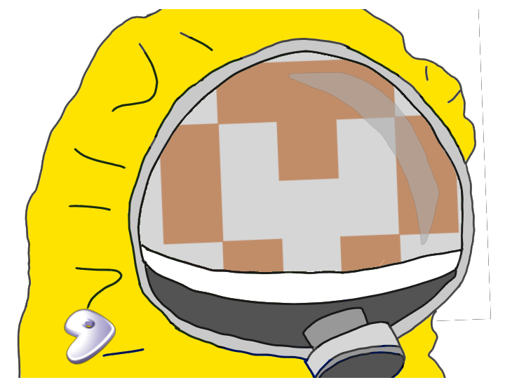
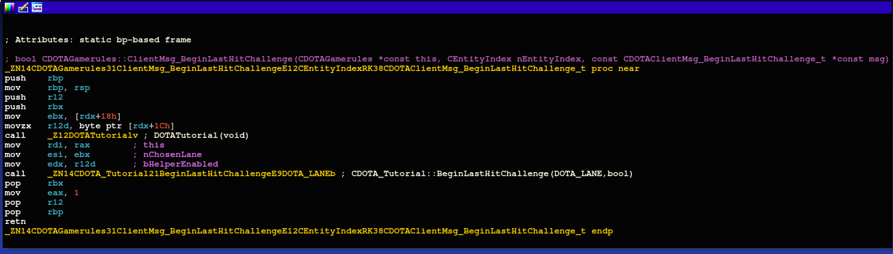
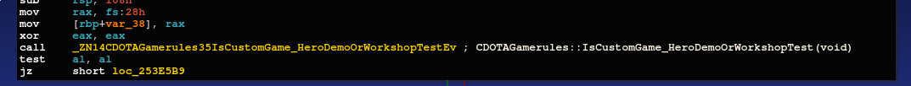
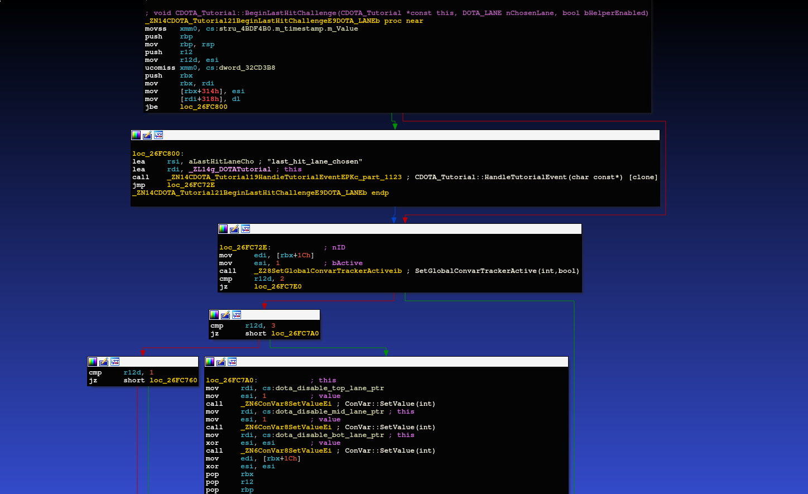
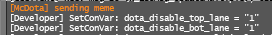
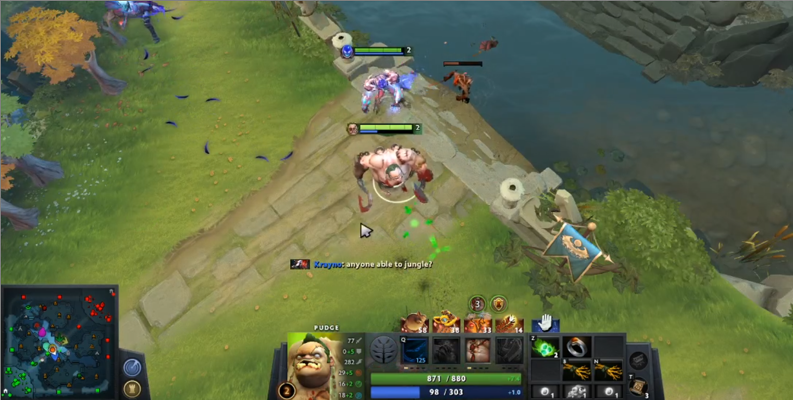

I'm sure by now you've heard of the new coronavirus outbreak in China.
This highly contagious virus currently has a 2% death rate.

But there is another bug that has formed in the video game: Dota 2.
We are currently calling this outbreak the Dota-Strain.

Being a Dota 2 Virologist-specialist, I, ki-- LWSS, will take you on a deep a dive of dota germs, genome, and geriatry.



## Sequencing
It was January 30th 2020, I was sequencing some dota receive handlers when I came across something strange,
`BeginLastHitChallenge`

Let's take a look at the structure of this message
```$xslt
message CDOTAClientMsg_BeginLastHitChallenge {
	optional uint32 chosen_lane = 1;
	optional bool helper_enabled = 2;
}
```

And the handler...



`info: DOTATutorial() just returns a pointer to a global object.`

This is promising, I don't see validation checks like with OnDemoHero (see below)



Let's take a look at the meat of the function `CDOTA_Tutorial::BeginLastHitChallenge()` - xref for "last_hit_lane_chosen" if you want to follow along at home.



It's actually very simple,
* Based on whether or not `helper_enabled` is set, fire an event. (dont care)
* based on the number passed into chosen_lane (1/2/3), it will set the convar's `dota_disable_top`, `dota_disable_mid`, and `dota_disable_bot`

With 1 = top, 2 = mid, 3 = bot, you can see what this was made for ( the last hit challenge ).

However when testing this, I noticed that it worked in my regular session (just `map dota`). 
I went on a custom lobby to test if it worked, and then again without cheats enabled. It seemed like the handler was registered, there was only one more test to do...


## Ground Zero

I went to Chile to study this new man-made bug, a 3rd world server is perfect for things like this. 
After loading into the match, I released the payload and saw the telltale signs of the infection.
 


`SetConVar=  telling my client that these convars were updated and to sync with the server.`

I abandoned the match and went to do more research...

## More Findings
* This needs to be done before the first creep wave in order to have an effect.
* Works with Dota+
* Sets towers in other lanes invulnerable
* Can be bugged to keep the creeps in an invulnerable lane, but is very hard.

#### Impact Score:
* Security [0/10]
* Disruptive [5/10]
* Ease [3/10]

*Overall*: 9/30 = 3/10, amusing but not harmful or majorly disruptive.

*Description*: Set creeps to spawn in only 1 lane for both teams. Other lanes are invulnerable.

## Outbreak
As an anarchist Dota 2 Virologist(and [Necrophos](https://gamepedia.cursecdn.com/dota2_gamepedia/4/45/Vo_necrolyte_necr_spawn_04.mp3) main), it is my belief that Dota must take measures to develop it's own antibodies or be plagued by the bugs.

Therefore I have added this to my free Dota 2 CRISPR-kit, McDota for a limited time only.



## Cures
* Don't register this handler on valve servers
* Check for demo mode / local server
* remove this feature
