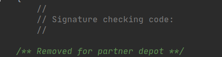
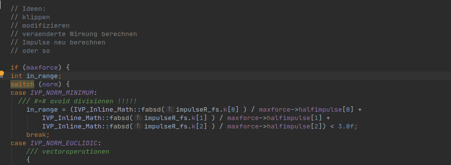

100% Open Source CS:GO

<style>
  canvas {position: relative; top: 0; display: inline;}
</style>
<div id='canvas-holder' style="position: relative; width: 100%; display: block;">
    <script src="/assets/js/three.min.js"></script>
    <script src="/assets/js/GLTFLoader.js"></script>
    <script src="/assets/js/OrbitControls.js"></script>
    <script src="/assets/js/kisak.js"></script>
</div>

## Preface

Back in late April of 2020, the source code of CSGO and TF2 were leaked. Since then, I've been working with the CSGO source code personally on a project that I call Kisak-Strike: Gentoo Offensive.

The Goal of Kisak-Strike is 100% open source CS:GO from the 2017-era for perservation, enthusiast use, and long term maintenance.

This blog post tells a rough historical story of the project up to today - in chronological order.

## The Leak

*(Some may know about this part already, and can safely skip to the next section)*

April 22nd, 2020 - Rumor of a CSGO source code leak spreads around various groups. At first this was hard to believe, but as the day progressed, a mega.nz link materialized and it was obviously true.

The leaks come from a Valve fanatic youtuber known as the Valve News Network(VNN). I don't really care for his videos much, but apparently his relationship with Valve is closer than he portrays in his videos.
VNN and his group of goons had gotten buddy-buddy enough with Valve to secure a Source Engine Partner relationship, something quite rare and normally only given to professional developers for games like: Titanfall, Insurgency, Vampire: The Masquerade, and a few others.

Anyone can use the Source Engine 2013 SDK, but it only contains headers for precompiled libraries. It isn't possible (without binary hacks) to modify the behavior/code of the engine because the Source Code is not included.
A Partner relationship is more advanced and grants access to the Source Engine Source.

The partner build isn't complete however. Valve thought that leaks were a possibility so they made sure to cut out sensitive bits of information. There are also 3rd party libraries, like Scaleform Flash UI, where Valve cannot give out the Source Code and instead give out precompiled-blobs.

## Opening the Leak

What exactly did we get in the leak? Let's see...


There's 2 folders to focus on - (which are initially contained in full.7z)

`cstrike15_src` - CSGO

`hl2_src` - TF2

There's also a concept game here called FStop. Can't say I was too interested in it, but while eyeballing it again for this post, I noticed it has some deferred rendering stuff in it that could be cool.

There's some boring chat logs and a Dota Merchandise concept, and lastly a note from the leaker himself.

```
full.zip is the entire Counter Strike: Global Offensive source code as of Operation Hydra and the TF2 source code as of Jungle Inferno.
These were willingly held onto by a select few of people, (VNN, etc) and kept in a very small circle. It was some kind of medium for them to jerk off about having secret shit
Some weird schizoid managed to grab both these codebases during his work on some 900th attempt of a HL2 VR project and his major goal was to have this circle leak it to the public and fly to his girlfriends house (also involved in the valve community) and kill himself and her. Absolutely fucking insane, and it's something to have a beer over and laugh about with your source modding friends
Ended up getting arrested after she fleed and cops had been called. 
A lot of interesting knowledge can be gained from these two codebases alone and a lot of resourceful information can come of it. Go wild!
```

Neat!


## Building CSGO - Act I: VPC Hijinks


For Windows users, this part was probably pretty easy, there's a .bat file to make it nice and easy to import into Visual Studio. But unfortunately for Linux gamers like myself, things were a bit rigged.

First off, let's check out CreateSolution.bat
```
devtools\bin\vpc.exe /csgo +csgo_partner /mksln csgo_partner.sln
pause
```

This is where the first "villain" of the story is encountered. 

[VPC](https://developer.valvesoftware.com/wiki/Valve_Project_Creator), the Valve Project Creator, is what's used to build this project.
 Basically, this is a custom build-system made by Valve in the Early 2000s back before CMake or Meson were popular. It has a high-level syntax that is translated into makefiles for each supported platform.
 
 On Windows, this means it will create Visual Studio .vcproj files for you.
 
 However on Linux, it will create a makefile for each project in their respective folders, and a master makefile `csgo_partner.mak` in the main directory.
 
 **As of this post, I count 73 build targets. A target is a static library, dynamic library, or executable file.**

First, I had to recreate the hardcoded build tools path.


/** I created a full guide back when the leak was new and exiting (https://gist.github.com/LWSS/9d2cd3205d197545d64fd27ee897fd53) that I will be referring to. **/


```
mkdir -p /valve/bin64/
cd /valve/bin64/
ln -s $(which ar) ar
ln -s $(which gcc) gcc-4.6
ln -s $(which g++) g++-4.6
#this part comes from cryptopp
mkdir -p /valve/steam-runtime/bin
cd /valve/steam-runtime/bin
ln -s $(which g++) g++
ln -s $(which gcc) gcc
```

The Valve Cookbook explicitly calls for GCC 4.6.3, I believe this is because of the CXX11 String ABI changes that happened that year, but can be reverted with a preprocessor definition `_GLIBCXX_USE_CXX11_ABI=0`. I went ahead and put this in some VPC files so I wouldn't have to bother setting up old GCC and patching it to work on today's systems. (Which I actually did first, see the link above)


Alright so after that, we have to manually build each one of the dependencies and put them in the `/lib` folder. Valve devs did not bother adding them to VPC because they theoretically never need to be rebuilt.

The dependencies are located in `/external` and `/thirdparty` and include: libSDL2_mixer, libtcmalloc, cryptopp, libPNG, libz, and more! I'm not going to talk about them in detail because it's pretty straight forward stuff, but if you want to see more read the gist linked above.

At this point we're ready to build with VPC! Here's the params I used.
```
./devtools/bin/vpc /csgo /f +csgo_partner /no_scaleform -dedicated_main -datamodel -stdshader_dbg -game_controls -movieobjects /mksln csgo_partner.sln /linux64
```

Then we just run `make` right? Well sure that would work but take over an hour, we need some threads but take a look here in the `csgo_partner.mak`


# to control parallelism, set the MAKE_JOBS environment variable
ifeq ($(strip $(MAKE_JOBS)),)
    ifeq ($(shell $(UNAME)),Darwin)
       	CPUS := $(shell /usr/sbin/sysctl -n hw.ncpu)
    endif
    ifeq ($(shell $(UNAME)),Linux)
       	CPUS := $(shell $(TOOL_PATH)grep processor /proc/cpuinfo | $(TOOL_PATH)wc -l)
    endif
    MAKE_JOBS := $(CPUS)
endif


We are to use MAKE_JOBS environment variable instead of the standard -j flag, and notice that if this is not included, it will auto-detect your thread count.

However, this doesn't work how you would expect it to. Remember earlier when I said that the project has about 73 targets(A target being a static library, dynamic library, or executable).
The MAKE_JOBS variable controls how many targets are built at once, this means that if you do MAKE_JOBS=20, it will start building 20 targets with 1 thread.

This is bad for 2 reasons, 

-1 Some of the targets are huge and take a long time, while most are medium-small. This means that the biggest targets will continue to build for 20 minutes while everything else is done.

-2 It doesn't take dependencies into account, which means that you will require **Multiple Build Sweeps** to get everything compiled.

The full build was taking over 20 Minutes on my Threadripper 2950x, and I wasn't satisfied with the workflow; This leads us into Act II...


## Building CSGO - Act II: Replace the whole Build System


/**
Rotten to the core. There's no saving it -- we need to pull it out by the roots. 
Wipe the slate clean. BURN IT DOWN! And from the ashes, a new (csgo build system) will be born.
 
Senator Armstrong
**/


CMake was the obvious choice for the new build system. I already knew it, it is the goto standard nowadays, and my favorite C++ editor, CLion, would gain superpowers once it was complete.

Now i'll show some example conversion from VPC->CMake.

One of the first ones I did was the ToGL project, don't ask why, I just clicked somewhere and took off.


Here's the start of the file, notice how variables are set with the `$Macro` keyword, `$include` statements are supported, and there is a `$Configuration` section.
Now let's see the CMake Version...


As you can see it's pretty similar, with a little extra meat on the CMake version. Each CMake file will include some of the common things like CMAKE_MODULE_PATH to be more modular. Every target in the Kisak-Strike project can be built separately at any time.

Now let's look at the source files.


This target is pretty simple, there's only a handful of .cpp files. One of the things you'll notice are the `[$VARIABLE]` blocks at the end of some lines.
These are VPC if-statements and the line is only included if that variable is set.


On the CMake side, it's pretty similar, but the if-statements are more obvious. One thing to note is that I didn't bother adding header files to the target sources. 
I've seen this before in similar CMake projects(dhewm3, RBDoom3BFG)  and the only reason to add it is if you would want them to show up in the Headers section of Visual Studio when importing a project. Visual Studio CMake support is slowly getting better, so soon I don't think it'll be needed at all.


Lastly there is a link-section at the bottom of the VPC `$Project` section.


This project links to tier2 and mathlib as you can see.


Same on CMake, but you might notice the extra libvstdlib. There's actually 4 hidden links deep within the bowels of VPC that get added to every project. I've dubbed these the "Stinky linkies" they are libtier0, tier1, interfaces, and vstdlib. I have them in the CMake base project but since this was the first one it looks like I added it manually and it can be safely removed.

Speaking of the CMake Base project, they are located in the `/cmake` folder of Kisak-Strike and only the linux version is implemented. 

All in all it took me about 2 months to finish the port to CMake, I ported the dependencies to CMake and even got things like the protobufs relying the on custom build output of the protoc compiler project.

#### Current Build times
`make -j30`
```
real	5m51.375s
user	153m53.981s
sys     12m14.018s
```
`make -j2 (DEDICATED) on a stinky VPS`
```
around 40 minutes flat
```

Massive improvements from the VPC build system, for reference it was taking me over 20 minutes to do a full build.

There is lots of room for improvement here too, we aren't even using ccache (like VPC does) nor are we using precompiled headers.

#### Side Adventure
Recently I found a blog post by a Linux Valve developer telling about his compile times. (And no I don't stalk Valve employees, it was linked in the VoGL wiki)

Here is the [post](https://linux-debugger-bits.blogspot.com/2014/09/glibtop-this-machine-has-56-cpus-32-are.html) written by a Mr. Mike Sartain 

```
Fully building TF2 dedicated server was taking around 13 minutes, 10 seconds on this:

Intel(R) Core(TM) i7-4930K CPU @ 3.40GHz
mikesart@mikesart-petra:~$ grep -c model.name /proc/cpuinfo
12

I tend to muck with the lower level libraries which meant I was spending quite a bit of my day waiting for these builds to finish.

TF2 dedicated server has:
 - 1347 cpp files
 - 13 DSOs (with 13 .dbg files)
 - 12 static libraries

[snip]

So I got one of these:

(2) Intel(R) Xeon(R) CPU E5-2697 v3 @ 2.60GHz
mikesart@mikesart-mint:~/valvesrc/ValveGames/staging/game$ grep -c model.name /proc/cpuinfo
56

The build time is now 3 minutes, 30 seconds.
```

With 56 threads, he got the build time to 3 minutes, 30 seconds for the TF2 DEDICATED server. Keep in mind that the dedicated server excludes compilation of whatever is not needed for a dedicated server (clientside code/graphics/UI).

#### Godlike Powers enabled in CLion

Now I want to show you the awesome powers my IDE has gained by porting the code to CMake.


/** Let's say we want to follow a function call through an interface,
how about Trace one of the CreateMove()'s the game has about 10 of those, quite annoying to find manually. **/



<video width="900" height="600" controls muted>
  <source src="../videos/traceCreateMove.mp4" type="video/mp4">
  Your browser does not support the video tag.
</video>


/** Hey that worked pretty good, what about some code-completion. **/


<video width="900" height="600" controls muted>
  <source src="../videos/bullrush.mp4" type="video/mp4">
  Your browser does not support the video tag.
</video>


/** Ha, now let's do some real code-completion. **/


<video width="900" height="600" controls muted>
  <source src="../videos/globalSyntaxSuggestion.mp4" type="video/mp4">
  Your browser does not support the video tag.
</video>


/** Now let's find every class that derives from IGameSystemPerFrame **/


<video width="900" height="600" controls muted>
  <source src="../videos/IGameSystemPerFrame.mp4" type="video/mp4">
  Your browser does not support the video tag.
</video>


/** One last test, let's find every single ConVar in the game,
this one should be very hard and compute-intensive. **/


<video width="900" height="600" controls muted>
  <source src="../videos/EveryConvar.mp4" type="video/mp4">
  Your browser does not support the video tag.
</video>

Great, that was on a standard SATA SSD and it only took just under 30 seconds to find 4148 ConVars in the entire codebase. This is a default-installation of CLion as well, I'm sure with more tuning, it could perform better.

The CMake version rocks, and I would like to add that Kisak-Strike compiles way more code than the VPC version. How much more? Well most of the dependencies + lots of extra *stuff* that was not included in the CSGO partner repo.

What *stuff* you may ask? Well continue to Act V to find out...

## Building CSGO - Act III: Resurrection of Code

Currently our CSGO looks like this:


Looks kinda slick, but it's non-functional. The In-Game UI is also missing, and there's tons of ScaleForm UI code ripped out.

The guns don't work, and several other things don't either.

The code has been neutered, most of the time with a message like this:



Luckily, we have some resources at our disposal that will be familiar to you if you've ever been involved in the CSGO cheating scene.
Valve has accidentally released debug versions of their games on Mac (and sometimes Linux), we will analyze these whenever we need to see what functionality is missing from a part of the code.


/** Now that i've seen the build system, I think I know why the debug versions leak sometimes.
On linux/mac it's not possible to build with debug symbols in a separate file like .pdb's on Windows
Instead they strip out the debug info in a postprocessing step.
I imagine that sometimes this step fails and their scripts publish the builds anyway **/


I'll go through one of these and show an example. Here's a function in `/game/shared/cstrike15/weapon_base.cpp` that might help us get our guns back.


This can be found in client, but also server as it's in the `shared/` folder. Let's open it in IDA.


Here we go, looks fairly small.


Alright so first off, we want to get the owner of this weapon. There's also a dynamic cast right below.


Why don't we take a peek at another function in this class...


That part with `GetPlayerOwner()` looks like what we want, and look here, it has a dynamic_cast.


Alright let's move to the next part... (Zoom In)


At the top you'll see our dynamic_cast code and then a quick if-statement block to check if null, then return.
After this the code loads up `C_BaseEntity::m_nPredictionRandomSeed` into a variable.
We can access this easily with `GetPredictionRandomSeed()` here:


After this, the code checks `weapon_legacy_recoiltable` to see if it's set. 
As an OG CSGO player, I happened to already know that this was related to the nospread patch where the spread seeds got changed to be server-sided.
It will either call `CCSWeaponInfo::GetRecoilOffsets()` or `g_WeaponRecoilData.GetRecoilOffsets()` depending on its state.
We have access to both of these functions already and in order to make sure we get it right, we can just take a look at them and see which one is not legacy.


Alright so according to this comment, this one is obsolete and will be used if `weapon_legacy_recoiltable` is set to 1.

We have one more small chunk to look at...


Which is pretty easy to read, just apply the resulting recoil to the Player Owner we got earlier.

The final code looks like this:


void CWeaponCSBase::Recoil( CSWeaponMode weaponMode )
{
    /** Removed for partner depot **/
    //lwss - rebuilt this function from reversing retail bins
    CCSPlayer *pPlayer = GetPlayerOwner();
    if ( !pPlayer )
        return;

    int seed = GetPredictionRandomSeed();
    float angle;
    float magnitude;
    if( weapon_legacy_recoiltable.GetBool() )
    {
        GetCSWpnData().GetRecoilOffsets( weaponMode, seed, angle, magnitude );
    }
    else
    {
        g_WeaponRecoilData.GetRecoilOffsets( this, weaponMode, seed, angle, magnitude );
    }

    pPlayer->KickBack( angle, magnitude );
    //lwss end
}


I like to keep the original Removal statement for historical purposes. You'll also notice the `//lwss` and `//lwss end`, this is something I picked up from one of my idTech friends.
It's a standard procedure to comment your changes with these blocks as a partner, so that when you ask for engine-support they can tell what changes you've made. I think it's a little outdated with modern VCS but it's kinda comfy and I thought it was appropriate for this project.

So that was one example of restoring code, as you can see the Debug bins are a valuable tool. They also happen to be from around the exact time this repo is from.
Another good resource is the accompanying TF2 leak, it seems to be more complete than the CS:GO version, and we will refer to it later in this post.

This was done a few more times to fully restore the weapons, make loadouts work(especially on the bots), and other various things.

## Building CSGO - Act IV: Unsustainable UI

Replacing the Scaleform UI was the next big task on my Agenda.

Keeping it was out of the question due to it being incomplete, proprietary, and laggy. 
I thought about hacking Panorama UI in, which would be pretty amusing, however it's closed source and doesn't fit the theme of the project.
I also thought about finishing the VGUI. I already knew that the codebase for VGUI was pretty bad after a previous attempt at doing a VGUI menu for another project, but after seeing it in more detail, I opted out!

I looked around a bit for some alternatives:

* Good ole' ImGUI - not customizable enough, only good for settings menus tbh.
* FlatUI - Abandoned, bloated, made by google
* Chromium Embedded - LAG
* EAWebkit - LAG
* Coherent Hummingbird(Diabotical) - Closed source, expensive, lame

I finally found the absolute perfect library for the job, and it's called RmlUI.

#### RmlUI
[RmlUI](https://github.com/mikke89/RmlUi), a fork of the abandoned libRocket, is an up-and-coming UI library. It uses custom trimmed-down versions of HTML and CSS along with a custom engine that is not WebKit-based.
It does not include any scripting languages by default (Which I like), however Lua support can be enabled.

The library is very well abstracted and the Documentation covers everything you need to know to implement the required interfaces(Rendering/System/Filesystem/etc).
In fact after testing out the included demo, I immediately started implementing the library into the game and didn't run into any major problems except for OpenGL state mismatches that were my fault.

#### Integrating RmlUI
I wanted to do a proper integration of the library, and in order to do this I would have to match or exceed the quality of the Scaleform code. 

Here is the layout of RmlUI in the KisakStrike code base:
* ADDITIONAL CMAKE FLAG -DUSE_ROCKETUI=1
* `/game/client/cstrike15/RocketUI/*`
    * Here is the cpp code for all of the CSGO custom elements. Each element will load a corresponding `.rml` file using the RocketUI interface.
    * Note that the RocketUI system consists of 2 Contexts, one for the Main Menu and another for In-Game. Naming Scheme RkHud loads to the in-game context and RkMenu to the Main Menu, an RkPanel can be loaded in either.
    * Rocket HUD elements are registered with `DECLARE_HUDELEMENT` and derive from `CHudElement`. This means that they are automatically called/registered with the game engine.
* `/public/rocketui/rocketui.h`
    * The `/public` folder is where you will find headers for interfaces, files in here are generally safe to include and mostly contain pure interfaces and predeclarations. The RocketUI Interface is here.
* `/rocketui/*`
    * This is a custom CTier3AppSystem implementation of the RocketUI interface. This is a new target that builds into a `rocketui.so` that will be loaded by the game on launch and jacked in via the `interface` system.
    * `rocketuiimpl.cpp` is the Main implementation for the interface Init/Connect/Disconnect.
    * `rocketrenderGL.cpp` is an OpenGL Rendering implementation. Ideally we would use the ToGL system, but I wanted to get something working first and this project is aimed to be Linux-Only.
    * `rocketfilesystem.cpp` File system chroot'd to the `${GAMEDIR}/csgo/rocketui/*` area in the game folders AND/OR pak files via the regular filesystem interface.
* `${GAMEDIR}/csgo/rocketui/*`
    * A New folder in the game directory that contains our new UI Layout and Style files, along with images, fonts, and templates.


Modifications made to the Existing Codebase:
* `/public/interfaces/interfaces.h`
    * `DECLARE_TIER3_INTERFACE` for RocketUI
* `/engine/host.cpp` - `_Host_RunFrame`
    * Calling into RocketUI on new frame. Used to update RocketUI and set the client realtime.
* `/engine/keys.cpp` - *various*
    * Input hook that goes to `RocketUI::HandleInputEvent()`
* `/engine/sys_dll2.cpp` - `CEngineAPI::Connect`
    * Addition of RocketUI Interface factory and setting value of `g_pRocketUI`
* `/engine/sys_mainwind.cpp` - `CGame::DispatchInputEvent()`
    * Copy a Scaleform hack here to stop Input hook while vgui console is open.
* `/engine/view.cpp` - `V_RenderVGuiOnly_NoSwap()
    * `RenderRocketMenu()` is called here.
* `/game/client/c_playerresource.cpp` - `C_PlayerResource constructor and destructor`
    * Call `g_pRocketUI->AddDeviceDependentObject()` on construction of C_PlayerResource and remove it on Destruction. This registers RocketUI to receive callbacks when the rendering device is updated. 
* `/game/client/viewrender.cpp` - `RenderView()`
    * `RenderRocketHUD()` is called here.
* `/materialsystem/cmatqueuedrendercontext.h`
    * Add `DEFINE_QUEUED_CALL`'s for RocketUI. This is needed for `mat_queue_mode` which means that the draw commands are stacked up and done on another thread. 99% of the time this is enabled because it gives 40-50% more FPS.

* Various others.


Some other things to Note:
* Enabled `WITH_OVERLAY_CURSOR_VISIBILITY_WORKAROUND` to get the system mouse cursor to stop flashing. (I'm sure you've noticed this if you played CSGO back when it had Scaleform and I would bet money that Valve enabled this in Panorama)
* Splitscreen slots are not implemented, but keep in mind they aren't implemented in Panorama either.
* Uses Raw OpenGL commands currently.

I had someone ask me how I implemented it and thought I would write up a decent overview for them to see, it also helps get an idea of how the engine hooks up to RocketUI exactly. For more information, you can see this [commit](https://github.com/SwagSoftware/Kisak-Strike/commit/92999771064cf1bdcc0a718dfdf255a092203913).

#### Showcase
What I wanted from the UI was something that was basic, fast, and did the job. There's always room for improvement after the functionality is there, and I designed the UI to be highly customizable by the end-user.

Here's a short video showing what it looks like:

<video width="900" height="600" controls muted>
  <source src="../videos/rocketuiShowcaseShort.mp4" type="video/mp4">
  Your browser does not support the video tag.
</video>

Everything is hooked up and working; very lightweight, performance impact is only about 1%.

This is the biggest original chunk of code in the KisakStrike codebase, but something that needed to be done seeing as the ScaleformUI was neutered and VGUI was never finished.

## Building CSGO - Act V: Chasing the Dream

This Act will be our crescendo, the amount of pure unbridled autism in this section is massive.
A Project months in the making, this is It, this final part truly took the most amount time and work, and I will try and show how.

First, let me state the Absolute objective for this project when I started it.

```
A Fully Open-Source CSGO for Linux, with no blobs, 
something able to be preserved by the users forever 
on any architecture or platform. 
```

If we got nuked tomorrow, and Steam went down, anyone could have CSGO up and running in the Bunker LAN by next week. 
Years later when us smoothskins are rockin' Power9 Rigs, we would also have the ability to recompile and port the game.

#### Evil Blobs

Anything Closed-Source is automatically evil. After making sure I had all our ducks in a row, these were the remaining closed-source blobs for the game.

* libphonon3d.so ( HRTF Audio )
* vphysics_client.so ( All Physics, Raytraces )
* gcsdk_client.a ( Game Coordinator )
* steamdatagramlib_client.a ( SDR Relays )

### HRTF Audio 

Let's start with an easy one, HRTF audio was added to game in a later patch. 
No offense, but I never really liked it, thought it sounded like I was underwater and could use more tuning.

I added #ifdef's to several of the audio engine code files and enabled this as an optional build step ( `-DUSE_VALVE_HRTF` ).

In the future I would like to explore some of the new OpenAL 3D audio extensions and see how well they work.

### Steam Datagram lib

Another easy one.

SDR Relays are only used to connect to Valve Matchmaking Servers. I want this project to have the best chance of staying publicly available, so I decided it was out of scope.

Added more #ifdef's and removed the functionality.

### GC SDK

Here's where things get interesting... Do you remember when I said that the TF2 leak had more content than the CSGO one?

The TF2 leak actually has this part, but of course it wasn't a straight paste job...

* CSGO specific stuff missing of course, and the initialization depended on that.
* There were updates to the GCSDK since TF2, inconsistencies regarding SOID_t, CSteamID, etc needed to be resolved.

New Files
* `/game/shared/gc_clientsystem.cpp/.h`
  * Basic GC connection. Generic baseline communcation. Generic Message Handlers
* `/game/client/cstrike15/cs_gc_client.cpp/.h`
  * CSGO specific messages. Message Handlers. 
* Protobufs were updated to the retail version to ensure they worked properly.

The `/gcsdk` and `/public/gcsdk` folder is from TF2. Note that `/gcsdk_original` and `/public/gcsdk_original` are the original ones that came with CSGO that were incomplete.

This component was actually very much needed for the Dedicated server to work because the blob that we got in the leak was not compiled with `-DDEDICATED` so some of the code in `/tier0/threadtools` was different. 
Originally hacks were made in this area to get the dedicated to work, but they have since been removed.

Here's what it looks like when logging in:


The Send/Recv msg's are a little touch that I did, they are Dota2-style. Right now there is just a simple handler for the Matchmaking Hello that shows some of your account info.


### Physics

The best was saved for last.

The physics engine was removed from the CSGO leak, after a brief look in the TF2 leak it appeared to be there.
`/vphysics` was there, it looked complete, and was the same interface version as the CSGO vphysics.

However, it relies on a folder called `/ivp` that was absent from both leaks.

At the time, I had no idea what IVP stood for. 
After some searching I discovered it stood for `Ipion Virtual Physics` and was a German middleware from around 1999 that later went out of business. It's hard to find information on them, but it seems they were absorbed by their competitor Havok in the early 2000's and no longer exist.

IVP was not anywhere online and seemed to be lost forever to the sands of time. Just when I thought all hope was lost, I thought of one more place to look... The infamous HL2 beta leak from 2003.
I looked online for this leak and didn't find it anywhere ( *While writing this article of course it's the 1st result that leads to vcc.wiki, go figure* ). I knew that I had downloaded it somewhere and started looking through old hard drives... After about an hour, I found it on my old 2016 drive, but did it have the `/ivp` folder?
 Bingo, it did!

##### 20th Century Abomination

After finally finding the ancient magicks from 1999, Germany, I was ready to paste it into KisakStrike and have it work. But, it wasn't even close to functioning.

This code is early C++, written by German Physicists in half-german, half-english, hard-coded to be 32-bit. There was int-pointer arithmetic scattered throughout the entire thing that would make it impossible to work on 64-bit.

Now of course these guys are a lot smarter than me, and I'm sure there's some solid mathematics in this code, but take a look at some of this:



For some reason they really loved using the thisptr to get back to an array address.


Lots of bitfields!


Some things from id Software?


Hey it's the Little/Big numbers, cute. Looks like they have a bit of bsp stuff too.


Did I mention I had the retail vphysics open in IDA? Looks like Valve also got to experience some fun in here. Copied their error message for swag of course.


I also did some things I'm not real proud of....


But it looks like I wasn't the only one hack'in


Here's the amount of `lwss`'s I added to the code altogether.


The code is in a super rough state, but I've duct-taped it enough so that it works. 

##### Raggedy Ragdolls
One area I had some trouble in was the Ragdolls, here's a blooper segment...

After getting it working, here's the initial result.

<video width="900" height="600" controls>
  <source src="../videos/physicsfubard.mp4" type="video/mp4">
  Your browser does not support the video tag.
</video>

Welp, looks like some data corruption, after spending god knows how long in the IVP code, I figured out it was the compiler optimizations. 
I started caveman'ing and applying optimizations to each of the cpp files and the culprit was `ragdoll_constraint_bp_builder.cpp`. 
The file is only about 210 lines, but don't ask me why it fails on O2 and not on O1!

Here we go take 2:

<video width="900" height="600" controls muted>
  <source src="../videos/sidewaysPhysics.mp4" type="video/mp4">
  Your browser does not support the video tag.
</video>

Well they're not spasm'ing, but it looks like when they die, they fly towards mecca instead of the ground. 
This was actually a bug that I introduced while upgrading the code.
In CSGO there is a feature where the ragdoll gravity can be set different from the rest of the physics. 
This is called `SetAlternateGravity()`, not the best name fellas, but I needed to have something there for the interface and here's what I had.


I messed up the Axis's of course, but I ended up removing this code completely instead of setting the game's gravity to the cl_ragdoll_gravity ( something silly in the first place ).

Take #3:

<video width="900" height="600" controls muted>
  <source src="../videos/workingPhysics.mp4" type="video/mp4">
  Your browser does not support the video tag.
</video>

Hoorah the ragdolls work.

##### Caveats and wrapping up

The Open Source Physics rebuild - known as Kisak-Physics does not implement the following:

* Ragdoll-Specific Gravity
* Cars
* Prediction (effects unknown!)

It's in a decent state now, but is an optional build-step due to not being perfect. Use `-DUSE_KISAK_PHYSICS` to enable.

## Building KSGO - Epilogue: The Future and You

Kisak-Strike is now 100% Open Source.

```
The only Closed-Source binary is the libsteam_api.so. 
This file is left for convenience and technically is not a part of the game.
If you were making a completely different game, you would still need libsteam_api.so to integrate into Steam.
```

I want to discuss some of the constraints I have put on this project.

1. Kisak-Strike is Linux-Only.
    * I don't care about Windows/Mac users, they both have the ability to come to Linux for free.
2. Kisak-Strike does not connect to Matchmaking
    * This doesn't seem appropriate. In the future, I might add community server connectivity. Currently, you will need to connect to a dedicated kisak-strike server.
3. Kisak-Strike has no skins
    * Something Valve is sensitive about
    
Kisak-Strike does not want to compete with the mainline game. Instead we want to take the game our own direction and have complete modding freedom over the code.

#### GitHub

Build it yourself! Create your own personalized build optimized for your computer!

Kisak-Strike can be found [here](https://github.com/SwagSoftware/Kisak-Strike)

Kisak-Strike additional files can be found [here](https://github.com/SwagSoftware/Kisak-Strike-Files)

```
Please note that this code is property of Valve-Software and any contributions that you make are considered a donation into the public domain.
```

#### End of Post

This one was pretty long, but I tried to keep it entertaining. Lots of stuff was left out in order to keep this readable, but I think I covered everything big.

Good luck gamers, and have a Merry Christmas!