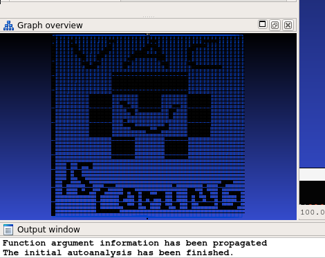
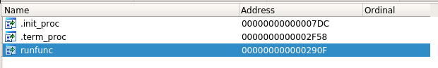
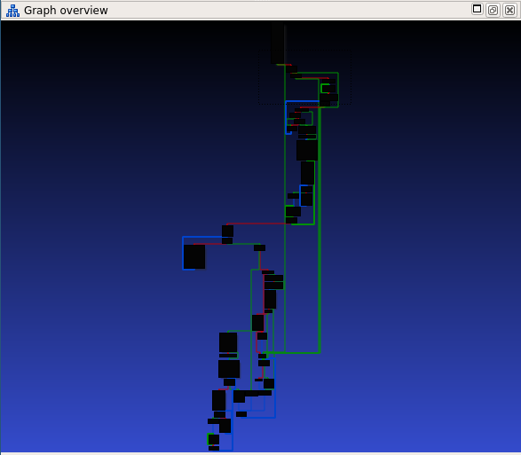
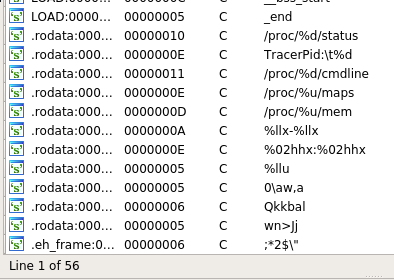
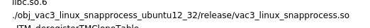
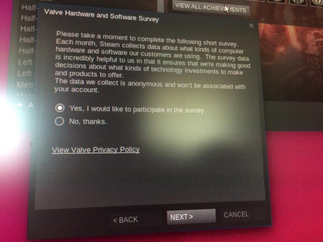

The purpose of this article is not to shame or blame, but just to entertain. 
Because after all, it's all about the video games :)

That being said, there are consequences for abandoning a match in said games.
There can be many factors out of your control that cause you to disconnect from an online-game.
Power outages, network outages, hardware problems, or maybe Steam keeps crashing for some reason.

Personally experiencing that last one prompted some investigation, so without further ado, here are my findings:

#### Overview
Quick overview on how VAC works- The VAC system runs on your computer and downloads executables from Valve HQ
and then runs them on your computer. Afterwards, it will send a result or data back to Valve. 

#### Tools of the Trade
We want to capture these executables and save them to disk so we can study them.
Luckily, this isn't really a new thing, so there are some tools that exist for doing just that.

##### [vac3-dumper](https://github.com/x1tan/vac3-dumper)
This is a tool I used back in 2018. It was great back then, but seems to be abandoned.
The sig inside the code is broken, but can be fixed by shaving off the bytes at the end after E8(call only has 1 unique byte).
You could probably use this, but there's a better alternative.
##### [vaclog](https://github.com/Heep042/vaclog)
Here is a Linux kernel-module made by my friend Heep.
I got him to make some small updates, and it's now working with the latest kernel. 
This tool is great and will do what you need, however there's no documentation.
Without going into too much detail, here's some steps...
 
After building it and loading it, make sure your game is open. 
Then echo the biggest/smallest pid into the vaclog proc file as shown

```bash
[root@localhost /]# pidof steam
7019 6557 6439
[root@localhost /]# echo "7019 6439" > /proc/vaclog
```
then use `dmesg --follow` to see the output.

## Modules


__*<sub><sup>some vac modules were not meant to be found...</sup></sub>*__

How are modules triggered? Randomly of course.
After you're done playing on a VAC-secured server, check out `/tmp/` for modules.

The modules will named like this:
`5565aefb-4b8c.so`
- 5565aefb - a checksum
- 4b8c - the bytesize

Let's go ahead and start analyzing these modules.

#### Entrypoint
Look for the exported function `runfunc`, this is what the steamclient.so will call after downloading the module.



I should mention that these modules are very simple, they only contain about 25 functions, and lot of those are tiny stubs.

Here we are



Hmm going through this whole thing would probably be beyond the scope of this article.

Let's check the strings...



Only about 50 strings... And with these it should be obvious what this module does. 
It opens several files in /proc/ and sends the data back to Valve Headquarters for Janitor Tycho to analyze.


>*Sidenote: this is the famous `cat /proc/$(pidof csgo_linux64)/maps | grep AimTux` module*


But uh-oh what is this string here??
 


#### Big Goof
It seems that a mistake was made at the VAC R&D Department.
The names of all the modules are embedded(and not used) in the strings section of the module.
This makes it even easier to tell what the modules do, and as an added bonus we get a glimpse into the secret VAC world.

## Catalog

Here is a small catalog I made of all the vac modules I got.


#### Snap Process
```text
./obj_vac3_linux_snapprocess_ubuntu12_32/release/vac3_linux_snapprocess.so
Size: 0x4b8c

Opens files:
-/proc/$(pidof game)/cmdline
-/proc/$(pidof game)/status  (particularly for TracerPid)
-/proc/$(pidof game)/maps
-/proc/$(pidof game)/mem

sends to Valve HQ
```

#### Directory Scan
```text
./obj_vac3_linux_directoryscan_ubuntu12_32/release/vac3_linux_directoryscan.so
Size: 0x3b58

Starts at /proc/$(pidof game)/cwd
follows symlink - readlink()
reads directory structure - fts_* family of functions

sends it to valve HQ
```
Time to delete imgui.ini guys?

#### Verify Client

```text
./obj_vac3_linux_verifyclient_ubuntu12_32/release/vac3_linux_verifyclient.so
Size: 0x3ba4

Sends /proc/$(pidof steam)/maps to Valve HQ
```
The smallest one yet, this one might be the oldest.

#### Hardware Scan

```text
./obj_vac3_linux_hardwarescan_ubuntu12_32/release/vac3_linux_hardwarescan.so
Size: 0x3b28

Parses /sys/devices
Interested in:
-idVendor
-idProduct
-bDeviceClass
-bDeviceSubClass
-bInterfaceClass
-bInterfaceSubClass
-bInterfaceProtocol
-vendor
-device
-class

Sends it to Valve HQ to HWID you

find /sys/devices -iname "xxx" - if you want to see what your system has
```
Do you remember this hardware survey popup?


Well it turns out even if you say no, Valve will still collect your information.
Also, __"The data we collect is anonymous and won't be associated with your account."__ is false.


## Summary
There you have it folks, a brief rundown on the features of VAC Linux 2020.

Unfortunately, I didn't reproduce my crashing in 2 weeks, but I have several other friends with the same problem.
Hopefully we can catch it soon and nail down what exactly it is.

If your steam crashes, check your `dmesg`, if you see something like this:
```text
[17488.763478] ClientModuleMan[7530]: segfault at e955b081 ip 00000000e955b081 sp 00000000b5afde80 error 14
[17488.763484] Code: Bad RIP value.

"ClientModuleMan" <--------thread name for VAC
```
then you are a victim of bad code! If you are able to reproduce this consistently, 
please leave a comment so we can investigate.

#### Meta
Hey guys, this was a bit of a filler post, but 
make sure to configure that RSS subscription(like you do for stallman.org).
Soon we will be revealing our secret organization, U.N.D.E.R. ,
and posting more interesting goodies once we are ready.