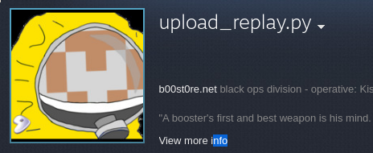
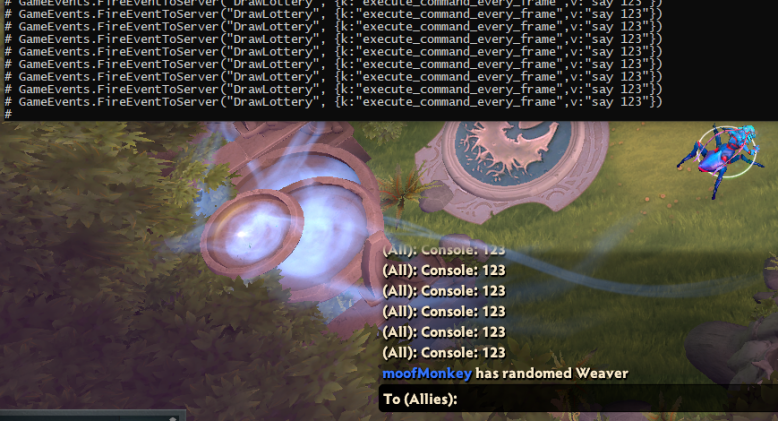
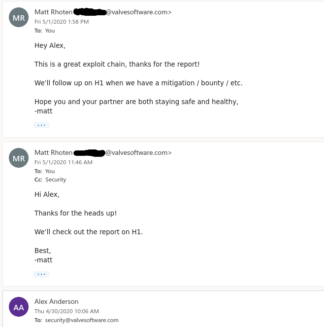
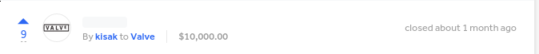

Minus the crowbar.


## Intro
While we were working on the Dota April Fool's joke, Moofmonkey and I ran into a funny string in the dota binaries.

`upload_replay.py`

It was amusing to see a python string here because there is no python used anywhere in the game client or server and the name was quite interesting.

In fact, I even set my steam name to that on Steam at that point in time.




/** I did not know however, that upload_replay.py was involved in a *critical* exploit. 
     Looking back this was an unintentional, subtle taunt **/


## Tinker'ing
In Mid-April, amidst various experiments, we remembered to revisit this mysterious python script.

The `upload_replay.py` script is actually not located anywhere on the Dota 2 depots that we can access.
Obviously, it has to do with their match-management system behind the scenes on Valve Dedicated servers.

First, we found related console-commands:
 
`dota_upload_replay` 
- concommand that will execute the replay_upload_script. Can accept arguments and pass them to the python script.

`dota_replay_upload_script` 
- convar that is normally set to `upload_replay.py`. I imagine this is here only for backend flexibility or testing during development.

On first inspection, the first command appears to use the syscall [execv](https://linux.die.net/man/3/execv) to launch python. 


This is actually quite-limiting because it would only allow us to pass arguments to python. We would probably need an arbitrary write or something to use this.

But, this analysis was from the leaked debug-build of Dota and not 100% accurate to the current build. 
The way this was done had been changed since mid 2017 and it was even more vulnerable.



/** The cursed system() call appears! **/


Now Dota forks off and calls system() instead. 

For fun, let's look at the CSGO source code and see what's there, it should be similar.


The problem with the system() call is that it is equivalent to `/bin/sh -c %INPUT%` which is pretty much just a bash shell.

So we now know we can execute any bash command by just running `dota_upload_replay` with a separator and arguments. 

```
Example: `dota_upload_replay "; pkill dota2"` will kill the game.
```
Now we just needed some way of running this on the server.

## Debate

This part of the experiment is up for debate in my opinion. 

I believe that only console commands marked with SERVER_CAN_EXECUTE will be ran on the server with a few exceptions. I have previously investigated the possibility of exploits with the userinfo and `cmd` subcommand systems.

Moofmonkey believes that `dota_upload_replay` was executable on the server and could prove it by making the server generate replays for junk-games with only 2 people.

However, neither of us could get the exploit to work on the Valve servers. It was as simple as typing a few words into your console before the bash command but it didn't seem to work.
 ( Our testing involved attempting to kill dota2, ping servers, etc ).
 
We theorized that the Valve Dedicated Servers probably had an SELinux or AppArmor config that was blocking our commands and needed more information.

## Custom Gamer

Moofmonkey was quite experienced with the custom game system and quickly threw together a framework that would allow us to dynamically interact with the Lua api on the server.
We got this "game" approved and used it to get more potential information.

However running concommands is not possible from Lua, you can only change convars, we needed a workaround. 
After some digging in the console, it didn't take long to find `execute_command_every_frame`, an odd convar.

This convar once set would be executed every frame and it was located in engine.dll, perfect for use in both client and server.
Just what we needed!



alright so now with the workaround we were finally ready to try again to kill the dota server. 
But unfortunately it still didn't work! We double and triple checked our methods, and still nothing.

## "I see.. I see...", said the blind man. 

Up to this point, all of our commands were blind. We didn't know the result or output of them and didn't think it was possible, but it's what we wanted to get next.

It took some brainstorming but eventually we came up with something that *could* work. In Source games, there is a /cfg/ folder containing files that can have convar/commands in them.
We could simply write something that `echo "say success" > ./cfg/file.cfg"` when our command succeeds and then execute that file on the server to see the result.

This is very ghetto but is similar to what we ended up using. The only problem with this is that the `say` command is rate-limited and won't send at all if it's being sent rapidly.
We got around this by registering a custom console command with LUA that would send us whatever was passed to it.

With this custom console command, we could finally get the immediate output of console commands on the server 

Some interesting ones: `sys_info, path, phys_list(is that a potential ASLR bypass?) and listdemo`

Here's an example of what we ended up using.
```
dota_upload_replay ";echo say command failed > /valve64/gaben/dota\ 2\ beta/icefrog-release/dota_v4148/dota/cfg/kisakrocks.cfg;echo $(ls /) | base64 | fold -50 | sed -e 's/^/lottery_test /' >> /valve64/gaben/dota\ 2\ beta/icefrog-release/dota_v4148/dota/cfg/kisakrocks.cfg"
```
* First we fill/replace the config file with a basic chat say command
* Then we run the command, run it through base64 to get rid of nasty characters and use fold to chop it up into sizable chunks
* The sed command will then prefix it with our `lottery_test`, this is our custom lua command name :P, then we put it line-by-line into the config file
* the .cfg file looks something like this when it's done.

```
lottery_test  d293IHlvdSBhY3R1YWxseSBkZWNvZGVkIHRoZXNlPw
lottery_test  a2lzYWsgIzEgdmFsdmUgZW1wbG95ZWU
lottery_test  dGhlIHBpZSBpcyBhIGxpZQ
...
```



/** Bonus Image! A fun little temp-tool to execute commands **/


## Pandora's Box

Alright it was time to try our savage methods again on the Valve servers once again. 

We had some more tricks up our sleeve now so we partied up and hosted our custom server on US East. This time everything worked perfectly and we were in like flynn.


/** Why did it not work before? Well I think this is due to luck. I can't give out backend information :=) but the distro Valve is using is known for having auto-updates break. I would like to believe this is what happened and it somehow disabled or broke the SELinux/Apparmor on this particular server. We did harvest some information on a couple other servers with the sys_info command before this and noticed some of them were out of date. **/


We had finally made it inside the Valve Dedicated Servers. It was truly a feast for the eyes. Gaben's mastercard plus the 3 digits on the back in plaintext, the alien movie pre-quel, the Half Life 3 beta, and the CSGO Source 2 Upgrade were all there and more. 

Unfortunately, I've been instructed specifically to not give out **any** details about the server. I even asked them if I could just talk about Distro and hardware specs, but nope.

At this point, we were ready to report it to Valve. I created a detailed HackerOne report and even emailed the security team in case they were monitoring the situation.

## Valve Responds

Within a day, I got an email back from a Mr. Matt Rhoten.



/** This guy seems alright, I'll have to add him to my list of favorite valves alongside Kisak, Tycho, and McJohn. **/


I normally keep these private but it's just formalities.
I want to showcase the response time here, Valve gets a lot of bad rep for being slow, which I definitely understand, but when you *actually* have a serious exploit, they seem to respond quickly.

They removed the console commands the next day from dota in a small patch, thus rendering us unable to exploit any other servers. We were careful to limit our exploit to just 1 server.

After some discussion back and forth on HackerOne with other valves we received a bounty of $10,000! Which we split evenly.



Very cool, I did not think Valve would be so generous after our various antics but it seems that we are being rewarded for resisting the temptation to host official Valve CSGO HVH and other memes that could have been.

## The End

That's all until next time readers. Make sure to hit that RSS feed button and check your emacs bindings like stallman would. There is always something big in the works and perhaps not just for Dota. 